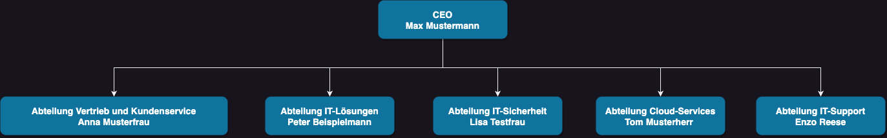

# 1. Netzwerk AG
:::info

Fake-Firma der Fallstudie

:::

## Beschreibung

Willkommen bei Netzwerk AG IT-Dienstleistungen!

Wir sind ein führendes IT-Unternehmen, das sich darauf spezialisiert hat, massgeschneiderte Netzwerk- und IT-Lösungen für Unternehmen verschiedener Branchen anzubieten. Unser Team von hochqualifizierten Experten verfügt über umfassende Erfahrung in der Bereitstellung innovativer Technologien und Dienstleistungen, die darauf abzielen, die Geschäftsentwicklung unserer Kunden zu unterstützen und zu beschleunigen.

Unsere Dienstleistungen umfassen ein breites Spektrum an Lösungen, die auf die individuellen Bedürfnisse unserer Kunden zugeschnitten sind:

1. Netzwerkdesign und -implementierung: Wir entwerfen und implementieren skalierbare und zuverlässige Netzwerklösungen, die eine nahtlose Kommunikation und Zusammenarbeit in Ihrem Unternehmen ermöglichen.

2. IT-Sicherheit: Die Sicherheit Ihrer Unternehmensdaten hat für uns höchste Priorität. Unser Team identifiziert potenzielle Sicherheitslücken und implementiert robuste Sicherheitsmaßnahmen, um Ihre Daten vor Bedrohungen zu schützen.

3. Cloud-Lösungen: Optimieren Sie Ihre IT-Infrastruktur und speichern Sie Ihre Daten sicher in der Cloud. Wir bieten Cloud-Migration, -Integration und -Management-Dienstleistungen an.

4. IT-Support und Wartung: Unser engagiertes Support-Team steht Ihnen rund um die Uhr zur Verfügung, um technische Probleme zu beheben und sicherzustellen, dass Ihre IT-Systeme reibungslos funktionieren.

5. Virtualisierung: Nutzen Sie die Vorteile der Virtualisierungstechnologie, um Ressourcen zu optimieren und die Effizienz Ihrer IT-Infrastruktur zu steigern.

Bei NetzwerkProfi IT-Dienstleistungen steht der Kunde im Mittelpunkt unserer Bemühungen. Wir setzen alles daran, eine vertrauensvolle Partnerschaft aufzubauen und langfristige Beziehungen zu pflegen. Unser Ziel ist es, Ihnen innovative Lösungen zu bieten, die Ihre Geschäftsprozesse verbessern und Ihnen einen Wettbewerbsvorteil verschaffen.

Kontaktieren Sie uns noch heute, um mehr über unsere umfassenden IT-Dienstleistungen zu erfahren. Gemeinsam gestalten wir die IT-Zukunft Ihres Unternehmens!

## Organigramm

**CEO - Max Mustermann**
Verantwortlich für die strategische Ausrichtung und Geschäftsentwicklung des Unternehmens.

**Abteilung Vertrieb und Kundenservice - Anna Musterfrau**
Zuständig für die Akquise neuer Kunden, Kundenbetreuung und Kundensupport.

**Abteilung IT-Lösungen - Peter Beispielmann**
Verantwortlich für das Design, die Implementierung und Wartung von IT-Lösungen für Kunden.

**Abteilung IT-Sicherheit - Lisa Testfrau**
Zuständig für die Analyse von Sicherheitslücken, Implementierung von Sicherheitsmaßnahmen und Incident Response.

**Abteilung Cloud-Services - Tom Musterherr**
Verantwortlich für die Bereitstellung und Verwaltung von Cloud-Lösungen für Kunden.

**Abteilung IT-Support - Sarah Testfrau**
Zuständig für den technischen Support und die Wartung der IT-Systeme der Kunden.

## Raumlichkeiten 
Die Räumlichkeiten von "Netzwerk AG IT-Dienstleistungen" sind darauf ausgerichtet, eine moderne und produktive Arbeitsumgebung für unser Team zu schaffen, während wir qualitativ hochwertige IT-Dienstleistungen erbringen. 
Hier ist eine Beschreibung der wichtigsten Bereiche:

1. Empfangsbereich: Beim Betreten des Gebäudes werden Kunden und Besucher von einem freundlichen Empfangsbereich begrüsst. Hier befindet sich eine Rezeption, an der sie von unseren Empfangsmitarbeitern herzlich empfangen werden.

2. Büros: Die Büros sind so gestaltet, dass sie eine offene und kollaborative Arbeitsatmosphäre fördern. Jedes Teammitglied hat einen eigenen Arbeitsplatz, der mit moderner Technologie und ergonomischen Möbeln ausgestattet ist.

3. Besprechungsräume: Für Kundenbesprechungen, Teammeetings und Projektplanungen stehen mehrere Besprechungsräume zur Verfügung. Diese sind mit hochwertiger Präsentationstechnik ausgestattet und bieten eine professionelle Umgebung für produktive Diskussionen.

4. Technik- und Serverraum: Da wir uns auf IT-Dienstleistungen spezialisieren, verfügen wir über einen speziellen Technik- und Serverraum. Hier werden unsere Server und IT-Infrastruktur gehostet und gewartet, um eine reibungslose Funktion unserer Dienstleistungen zu gewährleisten.

5. Entspannungsbereiche: Um das Wohlbefinden unserer Mitarbeiter zu fördern, haben wir Entspannungsbereiche eingerichtet. Hier können sich die Mitarbeiter in den Pausen erholen, miteinander kommunizieren oder eine Tasse Kaffee geniessen.

6. Schulungsraum: Da lebenslanges Lernen für uns von großer Bedeutung ist, haben wir einen Schulungsraum eingerichtet, in dem Schulungen, Workshops und Weiterbildungsmassnahmen stattfinden.

7. Technologie-Showcase: Um unseren Kunden die neuesten IT-Lösungen und Technologien zu präsentieren, haben wir einen Technologie-Showcase-Bereich eingerichtet. Hier können sie unsere Innovationen hautnah erleben.

Unsere Räumlichkeiten wurden mit dem Ziel gestaltet, eine inspirierende und effiziente Arbeitsumgebung zu schaffen, die es uns ermöglicht, innovative Lösungen für unsere Kunden zu entwickeln. Wir legen großen Wert auf ein angenehmes Arbeitsumfeld, das die Kreativität und Produktivität unserer Mitarbeiter fördert und gleichzeitig einen professionellen Eindruck bei unseren Kunden hinterlässt.

## Netzwerk Umgebung
Das Firmennetzwerk von "Netzwerk AG IT-Dienstleistungen" ist ein hochmodernes und gut strukturiertes IT-Netzwerk, das darauf ausgerichtet ist, eine sichere, stabile und effiziente Kommunikation und Zusammenarbeit innerhalb des Unternehmens sowie mit externen Partnern und Kunden zu ermöglichen. Hier sind einige wichtige Merkmale und Komponenten des Firmennetzwerks:

1. Netzwerktopologie: Das Netzwerk von Netzwerk AG verwendet eine Kombination aus einer Stern- und einer Ringtopologie. Dies ermöglicht eine zentrale Verwaltung und schnelle Kommunikation zwischen den verschiedenen Abteilungen und Büros.

2. Router und Switches: Im Kern des Netzwerks befinden sich leistungsstarke Router und Switches, die den Datenverkehr effizient steuern und die Übertragungsgeschwindigkeiten optimieren.

3. Firewall und Sicherheitslösungen: Die Sicherheit des Netzwerks hat höchste Priorität. Eine robuste Firewall sowie weitere Sicherheitslösungen schützen das Netzwerk vor unerlaubten Zugriffen, Viren und anderen Bedrohungen.

4. VPN (Virtual Private Network): Um eine sichere Verbindung zwischen entfernten Standorten und Mitarbeitern außerhalb des Unternehmens zu gewährleisten, nutzen wir ein Virtual Private Network (VPN).

5. WLAN: Um die Mobilität und Flexibilität der Mitarbeiter zu unterstützen, ist das Firmennetzwerk mit einem zuverlässigen und sicheren WLAN ausgestattet. Gäste und Besucher können ebenfalls auf ein Gäste-WLAN zugreifen.

6. Datenspeicherung und Backup: Eine hochleistungsfähige Storage-Lösung sorgt dafür, dass Daten zentral und sicher gespeichert werden. Regelmäßige Backups gewährleisten den Schutz und die Wiederherstellbarkeit wichtiger Unternehmensdaten.

7. VoIP-Telefonie: Für die interne und externe Kommunikation nutzt NetzwerkProfi eine VoIP-Telefonanlage. Dadurch können Sprach- und Videogespräche über das Internet geführt werden.

8. Monitoring und Management: Das Netzwerk wird rund um die Uhr überwacht, um mögliche Probleme frühzeitig zu erkennen und zu beheben. Ein zentrales Management-System ermöglicht eine effiziente Verwaltung des Netzwerks.

9. Redundanz und Ausfallsicherheit: Um eine hohe Verfügbarkeit sicherzustellen, sind wichtige Netzwerkkomponenten redundant ausgelegt. Sollte ein System ausfallen, übernehmen sofortige Failover-Mechanismen die Funktion.

Das Firmennetzwerk von Netzwerk AG IT-Dienstleistungen wurde mit dem Ziel entworfen, die Anforderungen eines modernen IT-Unternehmens zu erfüllen und gleichzeitig höchste Sicherheitsstandards zu gewährleisten. Durch regelmässige Updates und Optimierungen bleiben wir stets auf dem neuesten Stand der Technologie, um unseren Kunden eine reibungslose und sichere IT-Dienstleistung zu bieten.
