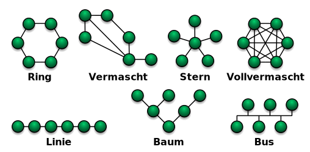
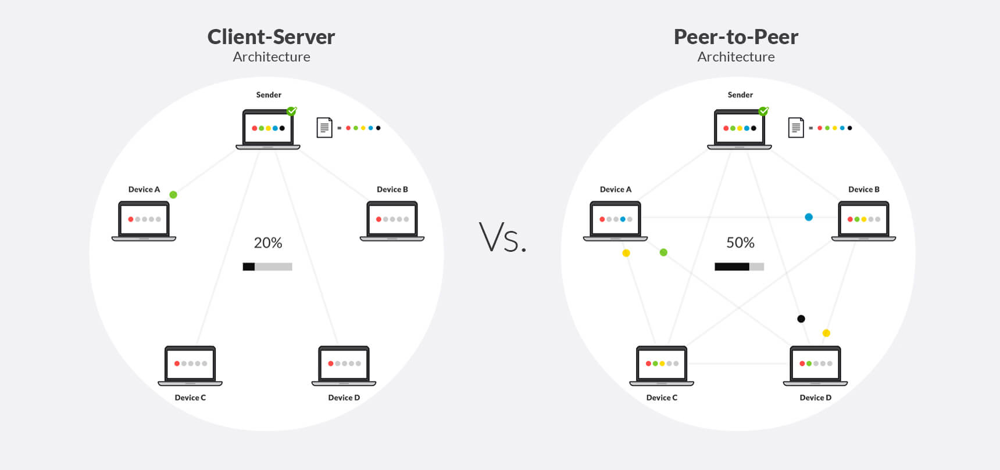
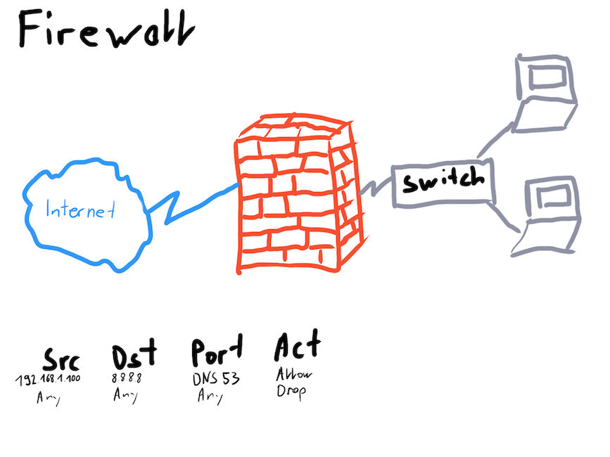
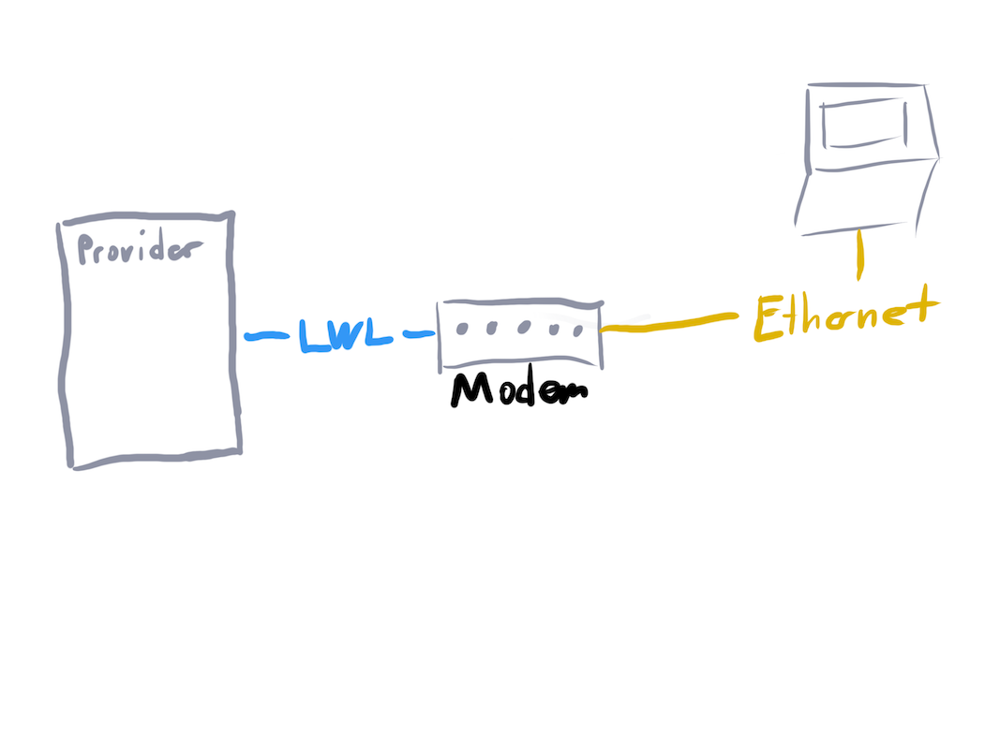
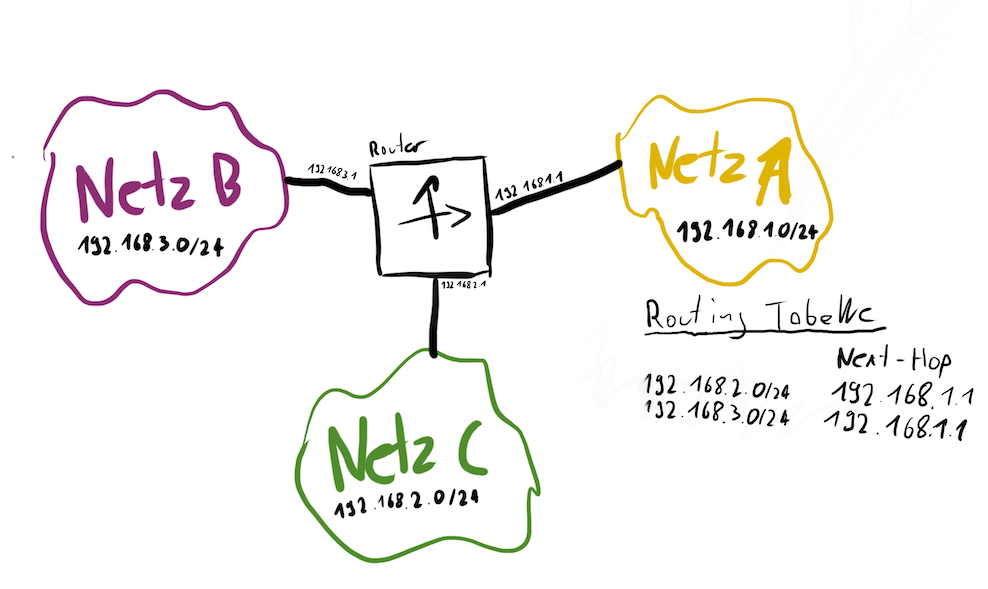
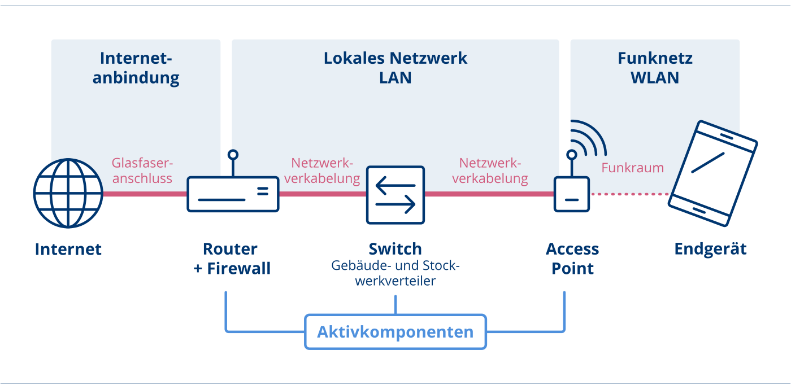
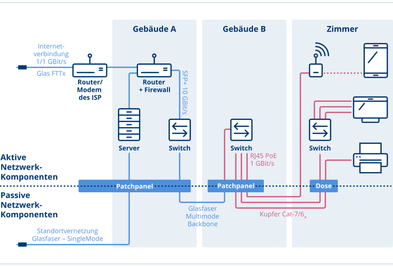

<!-- _class: big center -->
### Grundlagen
# Netzwerk
## Modul 117

---

# Was ist ein Netzwerk?

> „Ein Netzwerk ist die physikalische und logische Verbindung von mehreren Computersystemen. Jedes Netzwerk basiert auf Übertragungstechniken, Protokollen und Systemen, die eine Kommunikation zwischen den Teilnehmern eines Netzwerks ermöglichen. Ein einfaches Netzwerk besteht aus zwei Computersystemen.“

[**Elektronik-Kompendium.de** Grundlagen Netzwerktechnik ](https://www.elektronik-kompendium.de/sites/net/0503271.htm)

---

# Netzwerk Ausdehnung

- **LAN (Local Area Network) z.b. Firmen Netzwerk**
- MAN (Metropolitan Area Network) Ausdehnung bis zu 100 km
- WAN (Wide Area Network)
- **GAN (Globe Area Network) z.b. das Internet**

---

# Netzwerk Topologien
::: columns
Stern-Topologie
Baum-Topologie
Ring-Topologie
Bus-Topologie

::: split

:::
---

# Architektur

---

# Kabelbasierte Netzwerke
::: columns
- Geländeverkabelung (Primärverkabelung)
- Gebäudeverkabelung (Sekundärverkabelung)
- Etagenverkabelung (Tertiärverkabelung)
::: split
- Kupferbasierte Kabeltypen 
    - Twisted-Pair-Kabel
- Lichtwellenleiter / Glasfaserkabel

:::

---

# Funkbasierte Netzwerke
- [WLAN](https://www.bakom.admin.ch/bakom/de/home/telekommunikation/technologie/wlan.html)
- [Mobile Funk](https://www.bakom.admin.ch/bakom/de/home/telekommunikation/technologie/5g.html)

---

# Netzwerkgeräte und Netzwerkkomponenten
- Modem
- Router/ Gateway
- Firewall
- Switch
- WLAN AP

---

---

---

---

---

