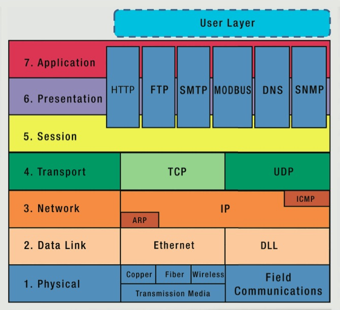
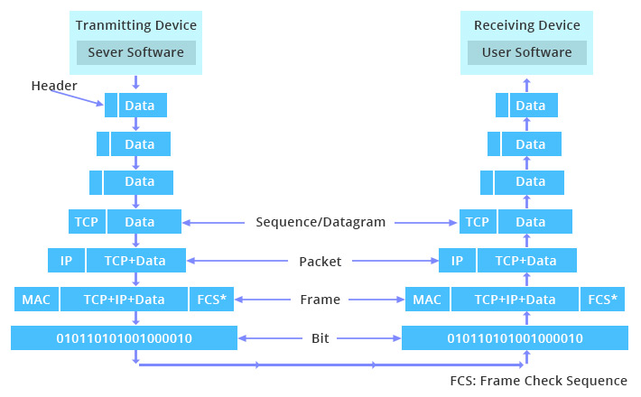
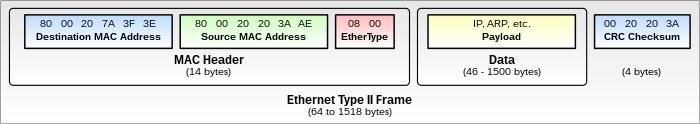

<!-- _class: big center -->
### Modul 117
## Informatik- und Netzinfrastruktur für ein kleines Unternehmen realisieren

---

<!-- _class: big center -->
### Aufbau von Netzwerken
# ISO/ OSI Model
## Modul 117

---
# ISO / OSI Model

---

---

---
# Layer 1 - Physical Layer - Bitübertragungsschicht

- Physche Verbindung, Kupfer oder Glas
- Kabel

---
# Layer 2 - Data Layer - Sicherungsschicht

- WLAN, Ethernet
- Punkt zu Punkt Verbindung
- Frame
- MAC

---
# Layer 3 - Network Layer - Vermittlungsschicht
- Pakete
- IP, ICMP
- IPSec
- Routing

---
# Layer 4 - Transport Layer - Transportschicht
- TCP
    - Verbindungsorientiert
    - z.b. E-Mail
- UDP
    - Verbindungsloss
    - 

---
# Zusammenfasung: 

7. Schicht / Anwendung: Funktionen für Anwendungen, sowie die Dateneingabe und -ausgabe.
6. Schicht / Darstellung: Umwandlung der systemabhängigen Daten in ein unabhängiges Format.
5. Schicht / Kommunikation: Steuerung der Verbindungen und des Datenaustauschs.
4. Schicht / Transport: Zuordnung der Datenpakete zu einer Anwendung.
3. Schicht / Vermittlung: Routing der Datenpakete zum nächsten Knoten.
2. Schicht / Sicherung: Segmentierung der Pakete in Frames und Hinzufügen von Prüfsummen.
1. Schicht / Bitübertragung: Umwandlung der Bits in ein zum Medium passendes Signal und physikalische Übertragung.

Quelle: https://www.elektronik-kompendium.de/sites/kom/0301201.htm
