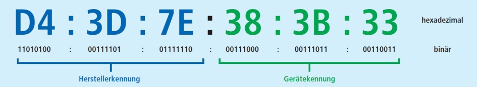
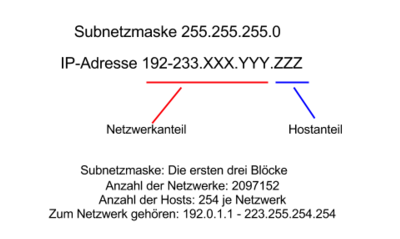
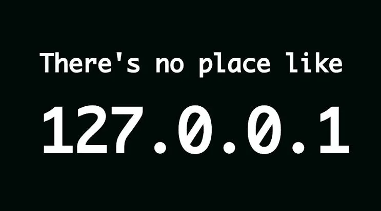

<!-- _class: big center -->
### Modul 117
## Informatik- und Netzinfrastruktur für ein kleines Unternehmen realisieren

---

<!-- _class: big center -->
### Aufbau von Netzwerken
# Adressierung
## Modul 117

---
# MAC (Media Access Control) - Hardware Adresse

- 48-Bit lange unterteilt in 6 Oktette (jeweils 8 Bit)

---
# IPv4 - Logische Adresse

- 32-Bit lang unterteilt in 4 Oktette (jeweils 8 Bit)
- Grundsätzlich 4,3 Milliarden Adressen

---
# Private vs. Public

| historische Namen | CIDR-Notation | Netzadressbereich | Anzahl Adressen |
| -------- | ------------ | ---------------------- |----------------|
| Klasse A   | 10.0.0.0/8   | 10.0.0.0 bis 10.255.255.255 | 16'777'216 |
| Klasse B  | 172.16.0.0/12   | 172.16.0.0 bis 172.31.255.255 | 1'048'576 |
| Klasse C  | 192.168.0.0/16   | 192.168.0.0 bis 192.168.255.255 | 65'536 |

---

---
# Static vs. Dynamic

---
# IPv6 - Logische Adresse
