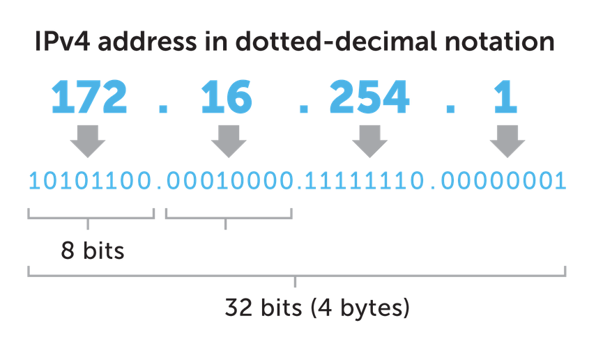
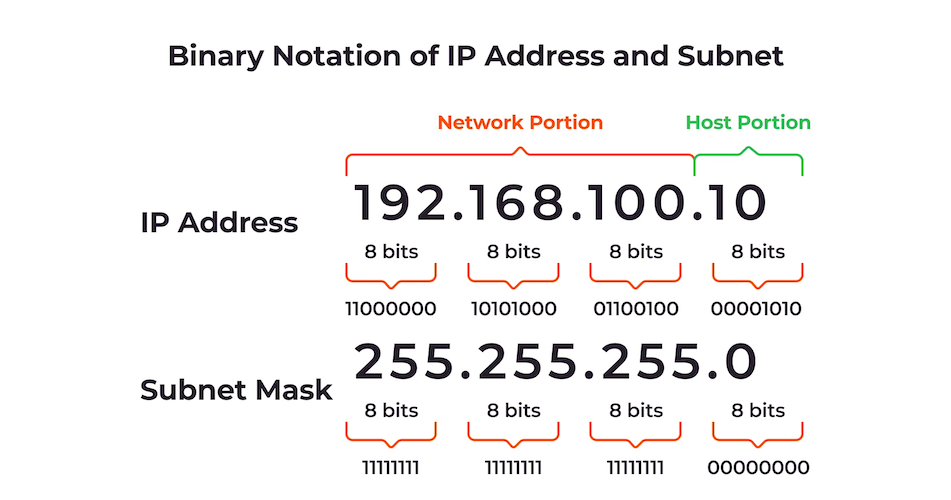
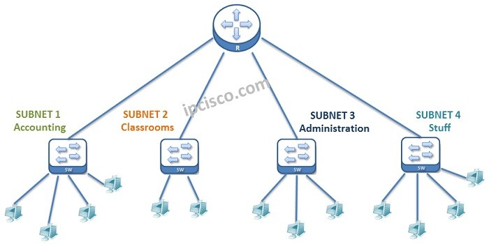
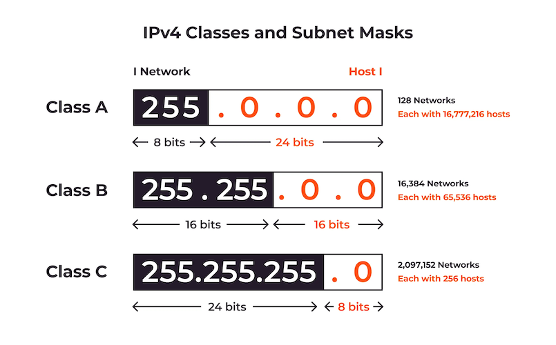
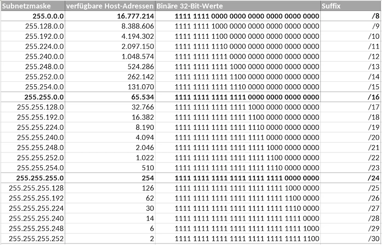
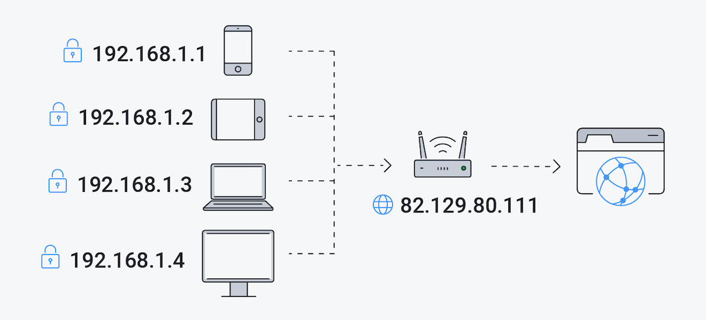
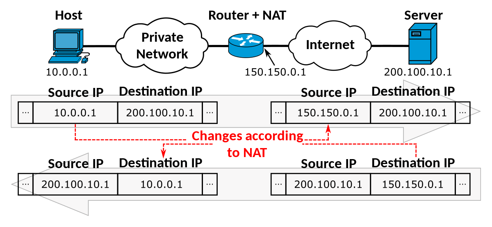
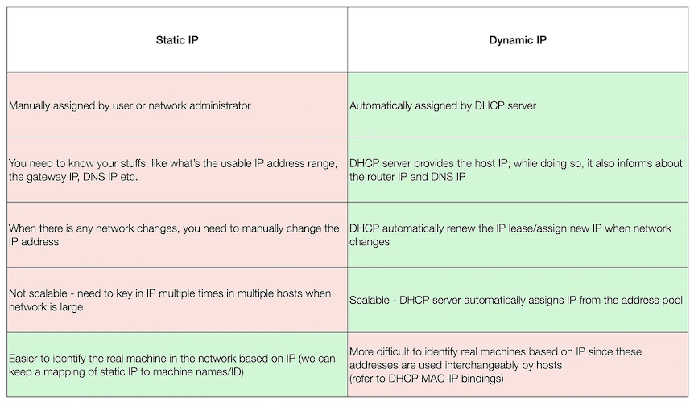
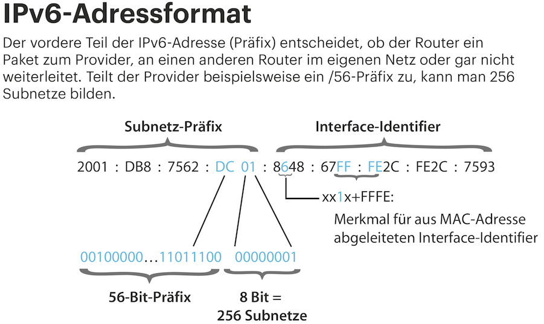

<!-- _class: big center -->
### Modul 117
## Informatik- und Netzinfrastruktur für ein kleines Unternehmen realisieren

---

<!-- _class: big center -->
### Aufbau von Netzwerken
# Adressierung
## Modul 117

---
# MAC (Media Access Control) - Hardware Adresse

- 48-Bit lange unterteilt in 6 Oktette (jeweils 8 Bit)

---
# IPv4 - Logische Adresse

---
# IPv4 - Subnetting

---

---
# IPv4 - Classen

---
# Private IP

| historische Namen | CIDR-Notation | Netzadressbereich | Anzahl Adressen |
| -------- | ------------ | ---------------------- |----------------|
| Klasse A   | 10.0.0.0/8   | 10.0.0.0 bis 10.255.255.255 | 16'777'216 |
| Klasse B  | 172.16.0.0/12   | 172.16.0.0 bis 172.31.255.255 | 1'048'576 |
| Klasse C  | 192.168.0.0/16   | 192.168.0.0 bis 192.168.255.255 | 65'536 |

---
# Subnetzmasken

---
Number of hosts = 2^(number of host bits)-2

---

---
# Public IP

---
# NAT

---
# Static vs. Dynamic

---
# IPv6 - Logische Adresse
