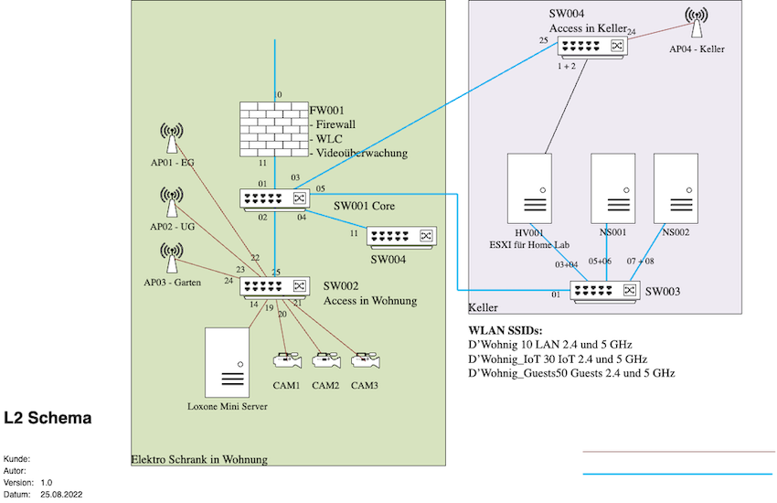
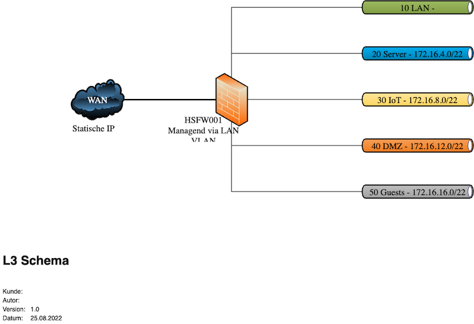

<!-- _class: big center -->
### Modul 117
## Informatik- und Netzinfrastruktur für ein kleines Unternehmen realisieren

---

<!-- _class: big center -->
### Netzwerkdokumentation 
#  Netzwerkdiagramm
## Modul 117

---

---
# Was gehört auf ein Layer 2 - Physische Netzwerkdiagramme?
- Physische Verbindunge
- Modem, Router, Firewall, Switch, WLAN AP, (Clients)
- Port Nr.
- Legende für Verbindungen und Abkürzungen
- Dokumentenkopf
    - Kunde
    - Dokumenten Titel
    - Datum/ Version
    - Ersteller

---

---
# Was gehört auf ein Layer 3 - Logische Netzwerkdiagramme?
- Logische Verbindungen / Routen
- Router, Firewall, Netzwerk (Subnetze/ VLAN)
- IP Adressen und Bereche, (VLAN Nr.)
- Legende für Abkürzungen
- Dokumentenkopf
    - Kunde
    - Dokumenten Titel
    - Datum/ Version
    - Ersteller
