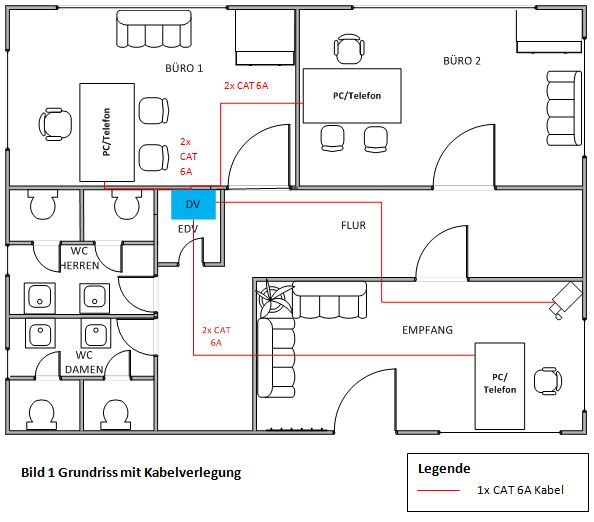

<!-- _class: big center -->
### Modul 117
## Informatik- und Netzinfrastruktur für ein kleines Unternehmen realisieren

---

<!-- _class: big center -->
### Netzwerkdokumentation 
#  Verkabelungsplan
## Modul 117

---

---
# Was gehört auf ein Verkabelungsplan?
- Grundriss mit allen Räum ( Büro, Technik und Konferenzräumen)
- Arbeitsplätze inkl. allen Geräte mit Netzwerk Anschluss (Computer, Tel. etc.)
- weiter Netzwerkgeräte (IP Cams, Drucker, Media Screen, WLAN AP)
- Netzwerkschrank
- Legende für Verbindungen und Abkürzungen
- Dokumentenkopf
    - Kunde
    - Dokumenten Titel
    - Datum/ Version
    - Ersteller
