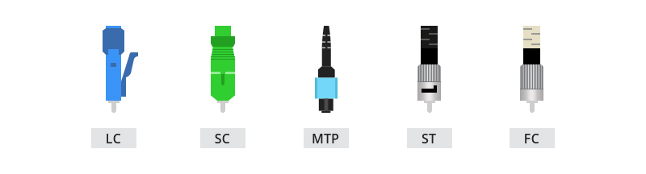

<!-- _class: big center -->
### Modul 117
## Informatik- und Netzinfrastruktur für ein kleines Unternehmen realisieren

---

<!-- _class: big center -->
### Kabel und Berechtigungen
#  Kabel und Stecker
## Modul 117

---
# Kupfer - Twisted Pair Kabel

---
# shielded vs unshielded

---
Abschirmungsart von Ethernet-Kabeln und ihre Anwendungen
Bevor Sie die Abschirmungsart von Ethernet-Kabeln kennen, sollten Sie sich mit dem Abschirmungscode vertraut machen.
- „TP“ steht für „Twisted Pair“ (verdrilltes Paar)
- „U“ steht für „Unshielded oder Unscreened“ (ungeschirmt oder ungeschirmt)
- „F“ steht für „Foil Shielding“ (Folienabschirmung)
- „S“ steht für „Braided Shielding“ (geflochtene Abschirmung)
- „A“ steht für „Armour“ (Panzerung)
---

---
# LWL

Mehr Infos im Video: https://youtu.be/N4fbAEp55lA

---
# Singel vs. Multimode

---

---
# Stecker

