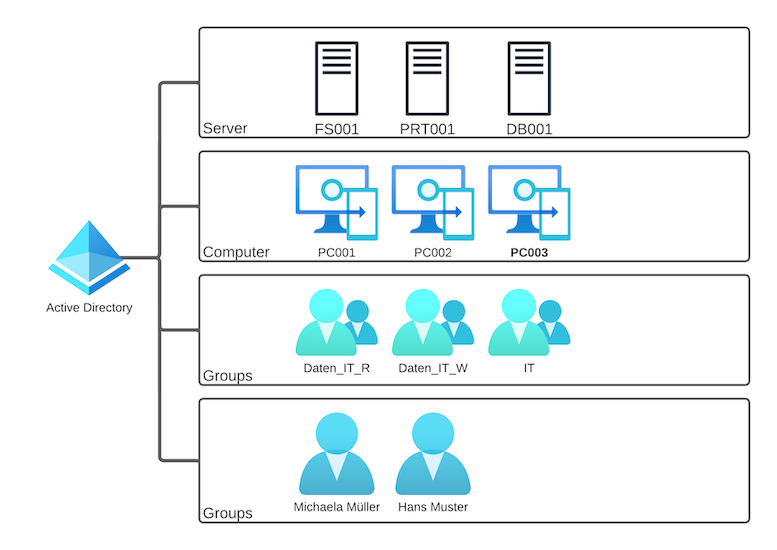

<!-- _class: big center -->
### Modul 117
## Informatik- und Netzinfrastruktur für ein kleines Unternehmen realisieren

---

<!-- _class: big center -->
### Kabel und Berechtigungen
#  Berechtigungen
## Modul 117

---
# Gruppen vs. User

::: columns s1
## Gruppen
- Berechtigungen pro Resource
- änderungen könnne Zentral gemacht werden
- mehr übersicht da alle Recht in Gruppen sind
- viel Gruppen bei granularen Berechtigungen
- keine verweisung von Berechtiungen

::: split
## User
- Berechtigungen pro User und Resource
- änderungen müssen auf der Resource gemacht werden
- weniger übersicht da Berechtigungen sind überall verteilt
- Berechtigungen könnne auf jeden User vergeben werden
:::

---
# Share Berechtigungen
| Gruppe     | Berechtigung     | Pfad        | Beschreibung                         |
|------------|------------------|-------------|--------------------------------------|
| Daten_IT_R | Lese             | \\\FS001.bbzbl.ch\Daten\IT | Lese Gruppe für IT Share|
| Daten_IT_W | Schreib und Lese | D:\Daten\IT | Schreib und Lese Gruppe für IT Share |

---
# Verzeichnis Dienste

---
# Least Privilege-Prinzip 1
Das Least Privilege-Prinzip besagt, dass Benutzer und Systeme nur die minimalen Zugriffsrechte erhalten sollten, die sie benötigen, um ihre Aufgaben zu erfüllen.
::: columns s3
### Warum:
- Minimiert das Risiko von Sicherheitsverletzungen und Datenlecks.
- Begrenzt die Auswirkungen von versehentlichen oder böswilligen Handlungen.
### Umesetzung:
- Identifizieren Sie die notwendigen Zugriffsrechte für Benutzer und Systeme.
- Gewähren Sie nur diese minimalen Rechte, nichts mehr.
::: split
### Beispiele:
- Ein normaler Benutzer benötigt keine Administratorrechte.
- Eine Anwendung sollte nur auf die Ressourcen zugreifen können, die für ihre Funktion erforderlich sind.
### Best Practices:
- Regelmäßige Überprüfung und Anpassung von Zugriffsrechten.
- Schulung der Benutzer in bewusster Nutzung von Zugriffsrechten.
:::

::: footnotes

1. ChatGPT: Least-Privilege-Prinzip zusammengefasst für Folie

:::
