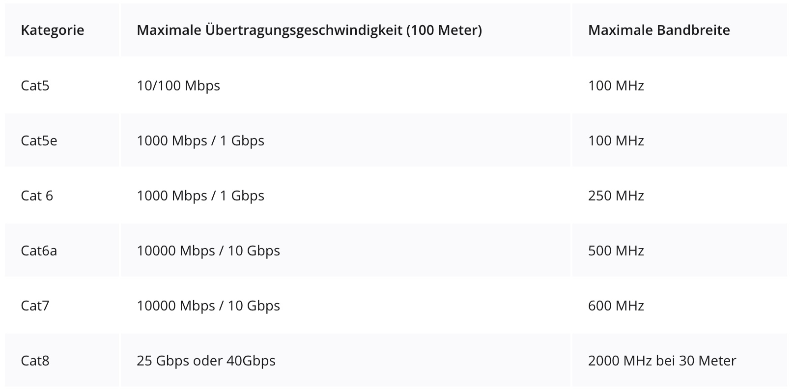

<!-- _class: big center -->
### Modul 117
## Informatik- und Netzinfrastruktur für ein kleines Unternehmen realisieren

---

<!-- _class: big center -->
### Kabel und Berechtigungen
#  Berechtigungen
## Modul 117

---
# Gruppen vs. User

---
# Share Berechtigungen

---
# Verzeichnis Dienste

---
# Least-Privilege-Prinzip

---